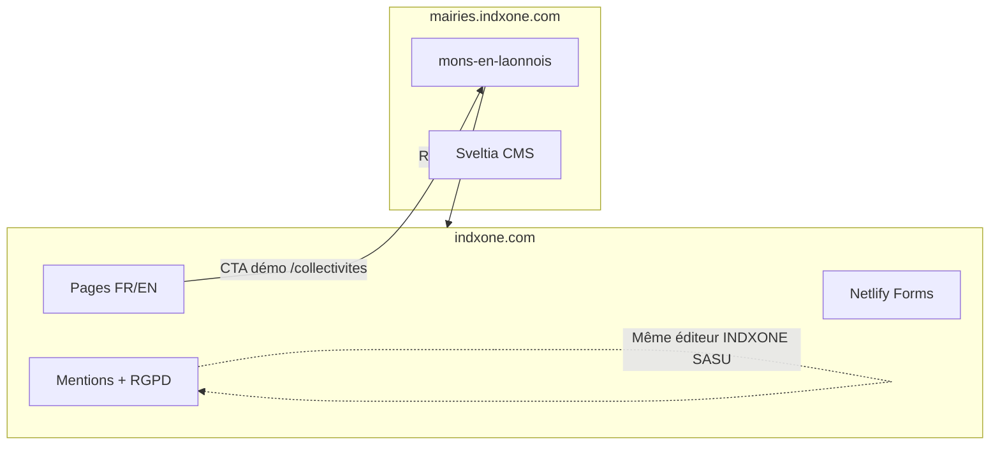

# Spécification — Mise en conformité et amélioration du site INDXONE (indxone.com)

| Champ | Valeur |
|-------|--------|
| **Version** | 1.0 |
| **Date** | 2026-05-17 |
| **Statut** | À valider |
| **Périmètre** | Dépôt `indxone-site` — site vitrine **https://indxone.com** |
| **Produit lié** | Offre collectivités → démo **https://mairies.indxone.com/mons-en-laonnois/** |
| **Spec sœur** | `indxone-mairies/mons-en-laonnois/docs/SPEC-conformite-amelioration.md` |

---

## 1. Rôle de l’orchestrateur

Ce document pilote la **conformité** et les **améliorations** du site corporate INDXONE en coordination avec le site pilote communal. Il évite de dupliquer les exigences mairie (rouge, CMS JSON, PWA commune) tout en garantissant **cohérence marketing**, **vérité des engagements** et **qualité technique** sur les deux propriétés.



---

## 2. Objet et finalité

**indxone.com** est le site de présentation d’**INDXONE SASU** (consultant SI / offre collectivités). Objectifs de cette spec :

1. **Conformité légale** (LCEN, RGPD, e-commerce B2B si devis en ligne) pour un site professionnel français.
2. **Cohérence des promesses** affichées (« RGPD natif », « Lighthouse 96+ », « 0 cookie tiers ») avec la réalité technique et juridique.
3. **Qualité produit** : performance, accessibilité, i18n FR/EN, fiabilité des formulaires.
4. **Réduction de la dette** : double stack statique + Astro, duplication HTML, redirects dangereux.
5. **Charte INDXONE** : identité **bleu nuit / or / encre** — distincte du **rouge communal** réservé aux sites mairies.

---

## 3. État des lieux (audit 2026-05-17)

### 3.1 Architecture

| Élément | État | Risque |
|---------|------|--------|
| **Production** | Build Node `scripts/build.js` → `dist/` + deploy Netlify | Référence opérationnelle |
| **Sources** | HTML statiques racine + `collectivites/`, `projets/`, `en/` | Maintenabilité moyenne |
| **Astro** | Dossier `astro/` partiellement migré, **non branché** sur `npm run build` (`build:astro` = stub) | **Dette majeure** — double vérité |
| **CSS** | `css/style.css` (modulaire) + `css/optimized.css` (PostCSS purge) | OK si build systématique |
| **Tests** | Vitest unit + Playwright e2e (`tests/`) | Sous-exploité en CI |
| **README** | Template GitLab générique | Documentation absente |

### 3.2 Pages et langues

| Route | FR | EN | Remarque |
|-------|----|----|----------|
| Accueil | `/` | `/en/` | OK |
| Collectivités | `/collectivites/` | `/en/collectivites/` | OK |
| Projets | `/projets/` | `/en/projets/` | OK |
| Merci | `/merci/` | `/en/merci/` | À vérifier en prod |
| Mentions légales | `/mentions-legales` | **Liens vers page FR uniquement** | **Gap i18n** |
| Confidentialité | `/politique-confidentialite` | **Idem** | **Gap i18n** |
| Accessibilité | **Absent** | **Absent** | **Gap conformité** |
| 404 | `404.html` | ? | **Compromis par redirect global** |

### 3.3 Conformité — écarts critiques

| ID | Écart | Gravité |
|----|-------|---------|
| **LEGAL-01** | `politique-confidentialite.html` indique *« aucun outil de tracking externe »* alors que **Plausible** est chargé sur toutes les pages | 🔴 Incohérence RGPD / publicité mensongère |
| **LEGAL-02** | Pages EN renvoient aux mentions/confidentialité **uniquement en français** | 🟠 UX + transparence |
| **LEGAL-03** | Absence de page **déclaration d’accessibilité** | 🟠 Attendu sites publics pro ; bonne pratique B2G |
| **MKT-01** | Affirmations « **Lighthouse 96+** » sans preuve archivée ni date | 🟠 Risque réclamation / DGCCRF |
| **NET-01** | `_redirects` : `/* → /index.html` **200** masque les vraies 404 | 🔴 SEO + sécurité perçue |
| **ARCH-01** | Stack Astro + statique en parallèle | 🟠 Drift, double maintenance |

### 3.4 Points positifs

- Formulaires Netlify avec **case consentement** (FR) et honeypot.
- **Plausible** (sans cookies) — bon choix si correctement documenté.
- Skip link, ARIA sur navigation, thème clair/sombre, JSON-LD Organization.
- Pipeline build (minify HTML, purge CSS), lint HTML/CSS, tests e2e de base.
- Sitemap FR/EN, redirects propres pour `/collectivites`, `/projets`, `/mairies` → produit.

---

## 4. Charte graphique INDXONE (référence officielle)

> **Le rouge `#D21C1C` est la couleur des sites mairies (offre collectivités), pas celle du site corporate indxone.com.**

### 4.1 Tokens corporate (`css/variables.css`)

| Rôle | Token | Hex | Usage |
|------|-------|-----|--------|
| **Texte principal** | `--ink` | `#0F1923` | Titres, corps, `theme-color` PWA |
| **Texte secondaire** | `--ink-light` | `#3D4F5C` | Descriptions |
| **Fond** | `--bone` | `#F7F4EF` | Fond page clair |
| **Primaire institutionnel** | `--blue` | `#1B3A6B` | CTA, liens forts, dégradés hero |
| **Primaire hover** | `--blue-mid` | `#2D5A9E` | États interactifs |
| **Accent premium** | `--gold` | `#C9A84C` | Highlights, badges |
| **Territoire / collectivités** | `--green` | `#2A7A4B` | Section collectivités, stats « mairie » |
| **Succès / erreur** | `--success` / `--error` | `#28C840` / `#FF5F57` | Feedback formulaire |

### 4.2 Couleur produit « Mairie » (usage marketing uniquement)

Sur **indxone.com**, les visuels « démo commune » peuvent **montrer** le rouge pilote (`#D21C1C`) dans les mockups / screenshots, avec légende « site communal » — sans remplacer la palette corporate sur la chrome du site INDXONE.

### 4.3 Exigence THEME-01

- [ ] Aucune généralisation du rouge mairie sur nav, footer ou CTA principaux d’indxone.com.
- [ ] `theme_color` manifest = `#0F1923` (déjà conforme).
- [ ] Documenter dans un `docs/CHARTE-graphique.md` les deux univers (corporate vs commune).

### 4.4 Critères d’acceptation — charte

- [ ] Revue visuelle : homepage + `/collectivites/` + `/en/` validées par le porteur de marque.
- [ ] Cohérence dark mode : contrastes WCAG AA sur `--bg-primary` sombre (`utilities/theme.css`).

---

## 5. Conformité juridique et RGPD

### 5.1 Pages obligatoires

| Page | Route | Action |
|------|-------|--------|
| Mentions légales | `/mentions-legales` | Compléter / maintenir (éditeur, hébergeur Netlify, propriété intellectuelle, médiation) |
| Politique de confidentialité | `/politique-confidentialite` | **Corriger LEGAL-01** (section Plausible + sous-traitant) |
| Politique cookies / traceurs | Section dans confidentialité ou page dédiée | Décrire Plausible (finalité stats, pas de cookies, IP anonymisée selon config) |
| Accessibilité | **`/accessibilite/`** (à créer) | État de conformité, contact, délai de réponse |
| CGV / devis | Si vente en ligne 490€ | Hors scope sauf activation paiement — documenter si ajout Stripe |

### 5.2 Internationalisation juridique (LEGAL-02)

| Exigence | Détail |
|----------|--------|
| LEGAL-I18N-01 | Créer `/en/legal-notice` et `/en/privacy-policy` (ou équivalent) |
| LEGAL-I18N-02 | Footer EN pointe vers les pages EN, pas vers le FR |
| LEGAL-I18N-03 | Ajouter `hreflang` sur toutes les paires FR/EN |

Exemple head :

```html
<link rel="alternate" hreflang="fr" href="https://indxone.com/" />
<link rel="alternate" hreflang="en" href="https://indxone.com/en/" />
<link rel="alternate" hreflang="x-default" href="https://indxone.com/" />
```

### 5.3 Formulaires de contact

| Champ | FR `contact-indxone` | EN `contact-indxone-en` |
|-------|----------------------|-------------------------|
| Netlify Forms | OK | OK |
| Consentement | `#consent` + label | Checkbox **sans** `id`/`for` — **corriger A11Y-FORM-01** |
| Lien politique | Ajouter lien cliquable vers politique près de la case | Idem vers `/en/privacy-policy` |
| Conservation | Documenter durée dans politique (ex. 3 ans prospects) | Idem |

### 5.4 Plausible Analytics (LEGAL-01)

**Texte cible** (à intégrer en § « Mesure d’audience ») :

- Outil : Plausible Analytics (Plausible Insights OÜ), script hébergé sur `plausible.io`.
- Finalité : mesure d’audience agrégée, amélioration du site.
- Données : pas de cookies publicitaires ; selon configuration : pages vues, référent, type d’appareil (voir doc Plausible).
- Base légale : intérêt légitime ou consentement selon avis juridique retenu.
- **Ne plus afficher** « aucun outil de tracking externe ».

**Marketing (MKT-01)** — reformuler les claims :

| Avant | Après (proposition) |
|-------|---------------------|
| « 0 cookie tiers » | « Sans cookies publicitaires · Analytics respectueux de la vie privée » |
| « Lighthouse 96+ » | « Conçu pour viser 90+ Lighthouse » ou « Score Lighthouse documenté : XX » (avec rapport daté dans `docs/audits/`) |

### 5.5 Critères d’acceptation — juridique

- [ ] Relecture par le dirigeant / conseil si budget.
- [ ] Politique FR et EN alignées sur Plausible et Netlify Forms.
- [ ] Claims marketing sur `/collectivites/` cohérents avec la spec mairie + audits réels.

---

## 6. Accessibilité (RGAA 4.1 / WCAG 2.1 AA)

### 6.1 Parcours prioritaires

1. `/` (FR) — formulaire contact  
2. `/en/` — formulaire EN  
3. `/collectivites/` — CTA vers démo mairie  
4. `/projets/` — filtres clavier  
5. `/mentions-legales`, `/politique-confidentialite`  
6. Bascule thème clair/sombre  

### 6.2 Exigences

| ID | Exigence |
|----|----------|
| A11Y-01 | Skip link → `#main-content` sur **toutes** les pages (vérifier sous-pages EN) |
| A11Y-02 | Focus visible en mode clair **et** sombre |
| A11Y-03 | `theme-toggle` : `aria-checked` synchronisé au clic (déjà partiellement) |
| A11Y-04 | Menu mobile : `aria-expanded`, fermeture `Échap`, piège focus si overlay |
| A11Y-05 | Filtres projets : accessibles clavier + annonce du nombre de résultats (`aria-live`) |
| A11Y-06 | Contraste cartes projets en filtre inactif (opacity 0.15) : ne pas être la seule indication |
| A11Y-FORM-01 | EN : `<label for="consent-en">` + `id` sur checkbox |
| A11Y-07 | Page `/accessibilite/` + lien footer |

### 6.3 Outils

- axe DevTools + WAVE sur les 6 parcours.
- Étendre Playwright : test EN consent, test `/collectivites/` CTA externe.

---

## 7. Performance, SEO et réseau

### 7.1 Lighthouse (TECH-01)

| Page | Perf | A11y | BP | SEO | Seuil spec |
|------|------|------|-----|-----|------------|
| `/` | mesurer | mesurer | mesurer | mesurer | **≥ 85** chaque |
| `/collectivites/` | idem | idem | idem | idem | ≥ 85 |
| `/en/` | idem | idem | idem | idem | ≥ 85 |

Actions typiques : `font-display: swap`, dimensions explicites images, LCP hero, réduire JS inline dupliqué.

### 7.2 SEO

| ID | Exigence |
|----|----------|
| SEO-01 | `canonical` unique par page FR/EN |
| SEO-02 | `hreflang` paires FR/EN |
| SEO-03 | Sitemap à jour ; soumission Search Console |
| SEO-04 | Open Graph `og:url` = URL canonique de la page (pas toujours `/`) |
| SEO-05 | JSON-LD : vérifier `@graph` sur toutes les pages clés |

### 7.3 Redirects (NET-01)

**Remplacer** la règle fallback dangereuse :

```diff
- /*  /index.html  200
+ /*  /404.html  404
```

Ou supprimer le fallback et laisser Netlify servir `404.html` par défaut.

**Validation :**

- `GET /page-inexistante` → **404** (pas 200 avec homepage).
- `/projets/` → toujours la page projets.

### 7.4 Sécurité (SEC)

Créer `netlify.toml` (absent aujourd’hui) :

```toml
[[headers]]
  for = "/*"
  [headers.values]
    X-Frame-Options = "SAMEORIGIN"
    X-Content-Type-Options = "nosniff"
    Referrer-Policy = "strict-origin-when-cross-origin"
    Permissions-Policy = "camera=(), microphone=(), geolocation=()"
```

| ID | Exigence |
|----|----------|
| SEC-01 | Headers ci-dessus en production |
| SEC-02 | `rel="noopener noreferrer"` sur tous les `target="_blank"` (audit grep) |
| SEC-03 | Pas de secret dans le dépôt ; variables Netlify pour futurs besoins |

---

## 8. Architecture et dette technique

### 8.1 Décision d’orchestration (ARCH-01)

**Option A — Recommandée à court terme :** statique seul

- Geler la migration Astro jusqu’à spec dédiée.
- Supprimer ou archiver `astro/` derrière branche `feat/astro-migration`.
- Documenter dans `README.md` le workflow `npm run build:all && deploy`.

**Option B — Moyen terme :** Astro source unique

- Terminer migration (checklist `astro/README.md`).
- Remplacer `scripts/build.js` par `cd astro && npm run build`.
- Tests e2e sur sortie Astro.

**Exigence ARCH-01 :** une seule stack en production d’ici **S+8**.

### 8.2 Refactorisations

| ID | Description | Priorité |
|----|-------------|----------|
| REF-01 | Utiliser `_includes/head.html`, `footer.html`, `nav` via build (SSI ou script assemble) au lieu de copier nav dans chaque HTML | Haute |
| REF-02 | Centraliser Plausible dans `_includes/analytics.html` (éviter double script footer + index) | Moyenne |
| REF-03 | Remplacer `README.md` template par doc projet réelle | Haute |
| REF-04 | CI GitLab : `npm run lint && npm run test:all && npm run build:all` sur chaque MR | Haute |

### 8.3 Fichiers suspects

| Fichier | Action |
|---------|--------|
| `startup-launch-kit-bloc.html` | Exclure du build public ou documenter usage |
| `*.backup` | Supprimer du dépôt ; ajouter au `.gitignore` |

---

## 9. Contenu, marketing et alignement produit

### 9.1 Offre collectivités

| ID | Exigence |
|----|----------|
| PROD-01 | CTA « Voir la démo » → `https://mairies.indxone.com/mons-en-laonnois/` (vérifier liens) |
| PROD-02 | Tarifs / délais (« 48h », « 490€ HT ») validés commercialement et juridiquement |
| PROD-03 | FAQ « RGPD natif » alignée avec spec mairie (formulaires Netlify, pas de trackers tiers sur le **site communal**) |

### 9.2 Cohérence inter-sites

| Sujet | indxone.com | mons-en-laonnois |
|-------|-------------|------------------|
| Couleur marque | Bleu / or / encre | Rouge `#D21C1C` |
| Analytics | Plausible documenté | Plausible (ticket MKT-02 mairie) |
| Éditeur | INDXONE SASU | Commune + hébergement IndxOne |
| Promesse Lighthouse | Claims marketing → audits | TECH-01 roadmap mairie |

### 9.3 Kit et preuves

- [ ] Dossier `docs/audits/` : rapports Lighthouse HTML datés (corporate + mairie).
- [ ] Captures « avant/après » pour `/collectivites/`.

---

## 10. Tests et CI

### 10.1 Existants à renforcer

| Suite | Fichier | Extension spec |
|-------|---------|----------------|
| E2E | `tests/e2e/basic.spec.js` | Pages collectivites, 404 réelle, lien démo mairie |
| Unit | `tests/unit/main.test.js` | Thème, formulaires |
| Lint | `html-validate`, `stylelint` | Bloquant en CI |

### 10.2 Nouveaux tests recommandés

```javascript
// Exemple : politique mentionne Plausible
test('privacy policy mentions analytics', async ({ page }) => {
  await page.goto('/politique-confidentialite');
  await expect(page.locator('body')).toContainText(/Plausible/i);
});

test('unknown URL returns 404', async ({ page }) => {
  const res = await page.goto('/this-route-does-not-exist-xyz');
  expect(res.status()).toBe(404);
});
```

---

## 11. Plan de livraison orchestré

### Phase 0 — Bloquants conformité (S0, ~3–5 j)

| Lot | IDs | Effort | Statut |
|-----|-----|--------|--------|
| Corriger politique confidentialité + claims | LEGAL-01, MKT-01 | 1 j | ✅ 2026-05-17 |
| Corriger redirect 404 | NET-01 | 0,5 j | ✅ 2026-05-17 |
| `netlify.toml` headers | SEC-01 | 0,5 j | ✅ 2026-05-17 |
| Formulaire EN a11y + lien politique | A11Y-FORM-01, LEGAL-I18N (partiel) | 0,5 j | ✅ 2026-05-17 |
| README projet | REF-03 | 0,5 j | ✅ 2026-05-17 |

### Phase 1 — Conformité complète (S+1–2)

| Lot | IDs |
|-----|-----|
| Pages légales EN + hreflang | LEGAL-I18N |
| Page accessibilité | A11Y-07 |
| Audit Lighthouse + corrections | TECH-01 |
| Audit axe complet | A11Y-* |
| Tests e2e étendus + CI | REF-04 |

### Phase 2 — Architecture (S+3–8)

| Lot | IDs |
|-----|-----|
| Décision Astro vs statique | ARCH-01 |
| Assemblage includes / DRY | REF-01 |
| Dossier audits marketing | PROD-03, docs/audits |

### Phase 3 — Alignement écosystème (continu)

| Lot | Coordination |
|-----|--------------|
| Lancement mairie Mons | Spec mairie Phase 0 |
| Harmoniser discours RGPD collectivités | Workshop 1h produit + juridique |
| Search Console + Plausible dashboard partagé | Ops |

---

## 12. Matrice de traçabilité orchestrateur

| Ticket spec indxone.com | Dépendance / miroir mairie |
|---------------------------|----------------------------|
| MKT-01 (claims Lighthouse) | TECH-01 mairie |
| PROD-01 (lien démo) | Déploiement mons-en-laonnois |
| LEGAL collectivités FAQ | SPEC mairie §4 RGPD |
| Analytics Plausible | MKT-02 mairie |
| Couleur rouge vs bleu | THEME-01 mairie (rouge) vs THEME-01 ici (bleu) |

---

## 13. Definition of Done — Site corporate « conforme »

1. **Juridique :** politique FR/EN exacte (Plausible, Netlify, formulaires) ; accessibilité publiée.
2. **Marketing :** plus de claim « 0 tracking » ou « 96+ » sans preuve archivée.
3. **Technique :** 404 réelles ; headers sécurité ; Lighthouse ≥ 85 sur 3 URLs.
4. **A11y :** zéro violation critique axe sur parcours §6.1 ; tests Playwright verts.
5. **i18n :** hreflang + pages légales EN.
6. **Ops :** CI verte ; README à jour ; une seule stack de build choisie (ARCH-01).
7. **Produit :** lien démo mairie fonctionnel ; discours collectivités aligné avec le pilote.

**Signataires :** Koffi NIAMKEY / INDXONE SASU, référent technique, (optionnel) conseil RGPD.

---

## 14. Annexes

### A. Commandes

```bash
cd indxone-site
npm install
npm run build:all
npm run test:all
npx lighthouse https://indxone.com/ --only-categories=performance,accessibility,best-practices,seo --output html --output-path ./docs/audits/lighthouse-home.html
```

### B. Inventaire routes à couvrir

- FR : `/`, `/collectivites/`, `/projets/`, `/merci/`, `/mentions-legales`, `/politique-confidentialite`, `/accessibilite/` (nouveau)
- EN : `/en/`, `/en/collectivites/`, `/en/projets/`, `/en/merci/`, `/en/legal-notice`, `/en/privacy-policy`, `/en/accessibility/` (nouveau)
- Redirects : `/mairies`, `/hub`, `/linkedin`, etc.

### C. Historique

| Version | Date | Modifications |
|---------|------|---------------|
| 1.0 | 2026-05-17 | Création — orchestration indxone.com + lien spec mairie |

---

*Document vivant. Mettre à jour après chaque sprint et synchroniser les claims marketing avec les audits réels des deux propriétés.*
